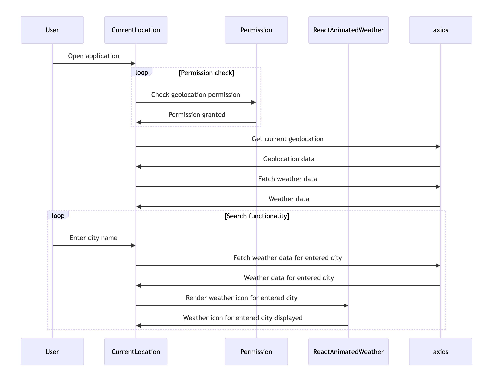

# Weather App

## Overview
The Weather App is a React application that provides real-time weather information based on the user's current location or a specified city. It leverages the OpenWeatherMap API to fetch and display weather data, including temperature, humidity, visibility, wind speed, and general weather conditions.

## Features
- **Geolocation-based Weather Information**: Automatically fetches weather data based on the user's current location.
- **City Search**: Allows users to search for weather information in a specific city.
- **Animated Weather Icons**: Displays weather icons using the `react-animated-weather` library for a more engaging user experience.
- **Real-time Updates**: Weather information is updated every minute to ensure data freshness.

## Sequence Diagram


### Brief Explanation
1. **User Requests Location**: The application requests the user's location using the Geolocation API.
2. **User Grants/Deny Permission**: The user either grants or denies location access.
3. **Fetch Weather Data**: If permission is granted, the app fetches weather data from the OpenWeatherMap API using the coordinates obtained.
4. **Display Weather Information**: The app displays the weather information on the screen. If the user denies permission, a prompt to enter a city is displayed.
5. **City Search**: Users can enter a city name to fetch weather data for that specific location, which is then displayed.

## UI Screenshot


## Installation

### Prerequisites
- Node.js (v14 or higher)
- npm (v6 or higher)

### Steps

1. **Clone the Repository**
   ```bash
   git clone https://github.com/yourusername/weather-app.git
   cd weather-app
2. **Install Dependencies**
   ```bash
   npm install
3. **Install Dependencies**
   ```bash
   npm install
4. **Install Dependencies**
    Create a .env file in the root directory and add your OpenWeather API key
   ```bash
   VITE_API_KEY=your_api_key_here
5. **Run the Application**
   ```bash
   npm run dev
6. **Build the Application**
   ```bash
   npm run build